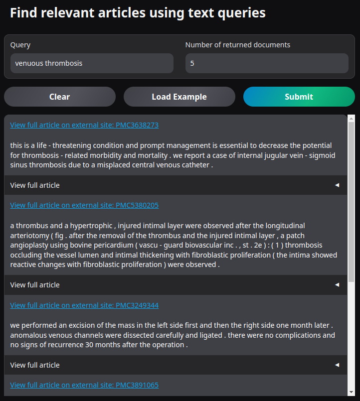

# 🧠 Scientific Paper Semantic Search

This project provides an interactive web interface to semantically search scientific research papers using vector embeddings. It leverages **Sentence Transformers**, **Qdrant**, and **Gradio** to create an intuitive and powerful search experience tailored for academic texts.


### 🌐 Live Demo

You can try the app instantly without installing anything:

🔗 **[Launch Live Demo on Hugging Face Spaces](https://huggingface.co/spaces/yeastcoast/pubmed-central-semantic-search)**

> **Note:** The demo uses a Qdrant-hosted vector store preloaded with **1,000 scientific papers** from **PubMed Central (PMC)**.

---

---

## 📑 Table of Contents

- [Introduction](#introduction)
- [Features](#features)
- [Installation](#installation)
- [Usage](#usage)
- [Project Structure](#project-structure)
- [Configuration](#configuration)
- [Examples](#examples)
- [Dependencies](#dependencies)
- [Limitations](#limitations)

---

## 🚀 Introduction

This project enables semantic querying of scientific papers using natural language input. It retrieves the most relevant documents and highlights the most pertinent paragraphs. Behind the scenes, documents are embedded and indexed in Qdrant, a vector database, and retrieved using cosine similarity.

---

## ✨ Features

- Upload scientific articles from PMCIDs or datasets.
- Sentence-level chunking and indexing for fine-grained retrieval.
- Gradio-powered web UI with real-time document rendering.
- Highlighting of most relevant paragraphs.

---

## ⚙️ Installation & Configuration

Ensure you have Python 3.9+ installed, then install dependencies:

```bash
pip install -r requirements.txt
```

Set the following environment variables:

### Environment Variables

| Variable         | Description                      | Default    |
|------------------|----------------------------------|------------|
| `QDRANT_URL`     | URL to the Qdrant instance       | `:memory:` |
| `QDRANT_API_KEY` | API key for Qdrant (if required) | `""`       |

If you don't set `QDRANT_URL` an in memory store will be used.

---

## 🧪 Usage

Start the Gradio app:

```bash
python app.py
```

Enter your query, set the number of documents to retrieve, and submit to see relevant articles and highlighted paragraphs.

## 💡 Examples

Once running, click "Load Example" to search for:

```
venuous thrombosis
```

This will return the most relevant paragraphs and links to scientific articles.



---

## 📚 Dependencies

See [`requirements.txt`](requirements.txt) for full list. Key libraries include:

- `gradio`
- `torch`
- `sentence-transformers`
- `qdrant-client`
- `datasets`
- `tqdm`

---

## ⚠️ Limitations

- **PDF upload** is not yet implemented (`fetch_pdf.py` is a stub).
- Only supports **EuropePMC** via PMCID for external article ingestion.
- The live demo is limited to **1,000 papers** from **PMC** (hosting is expensive ☹️).

---

